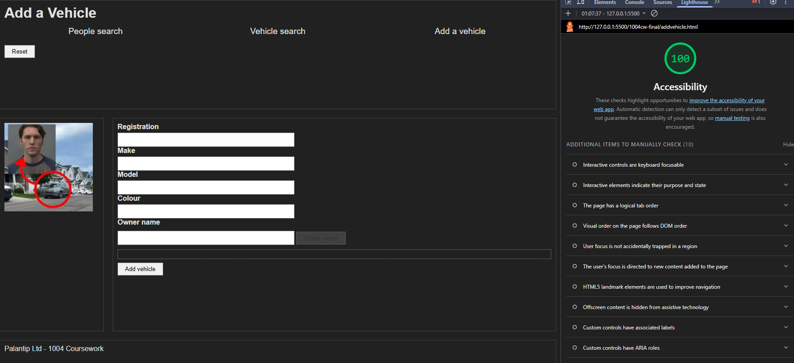
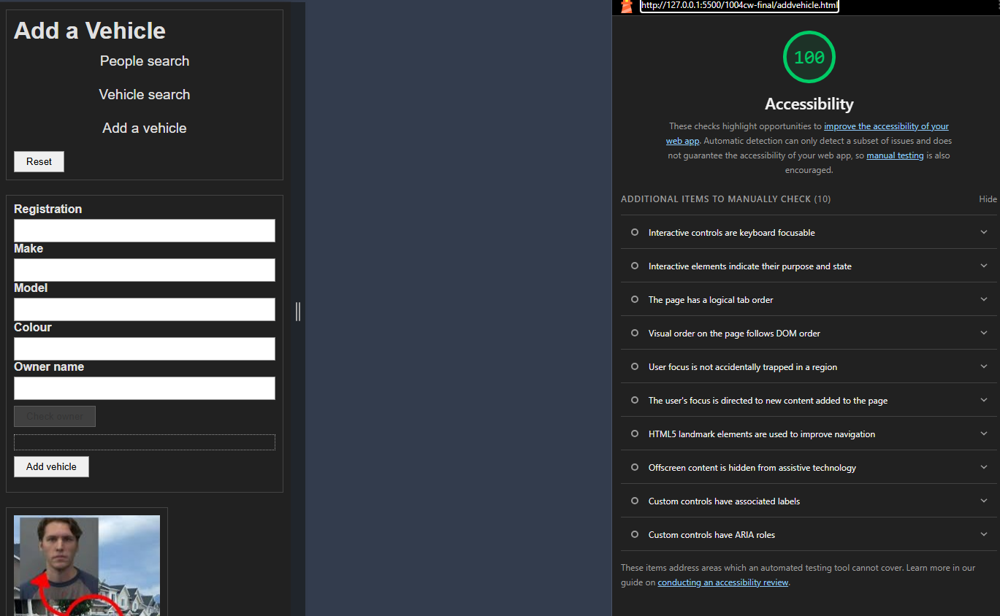
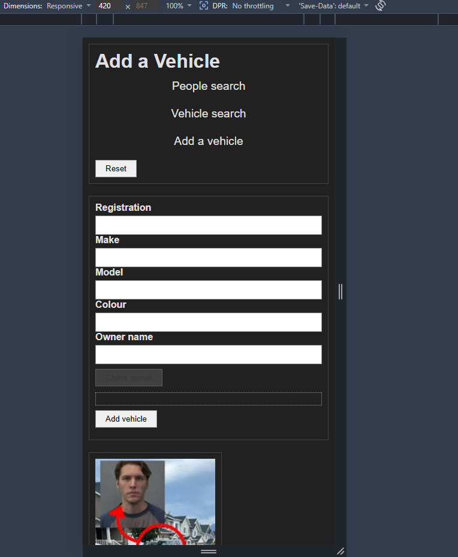

# COMP1004 Coursework

## HTML

- `lang="en"` in all `<html>` files (line 2)
- Added `aria-label="Main navigation"` to all `<nav>` elements (all files)
- All inputs have `<label>` elements (all files)
- All images have `alt` description (all files)
- Added `aria-live="polite"` to `#message` and `#results` elements so screen readers read dynamic content

## CSS

### Layout (line 97-107)

- Navigation links stack vertically using `flex-direction: column`
- Sidebar moves below main content because of `grid-template-areas`
- Sidebar maintains 1:4 ratio with footer column using `grid-template-columns: 1fr 4fr`

### Accessibility (line 56-64)

- Changed nav bar text colour and decoration to increae contrast against background
- Added padding to nav elements to increase touchpoint size on mobile devices

## JS

_Additional tests are in `tests/coursework-sample.spec.js from line 181_

| Test                                    | Condition tested                                            |
| --------------------------------------- | ----------------------------------------------------------- |
| empty fields shows error                | Add vehicle clicked with no fields filled                   |
| check owner disabled when owner empty   | Check owner button is disabled until owner field has text   |
| check owner enabled when owner has text | Check owner button enabled once owner field isn't empty     |
| no owner match shows new owner button   | New owner button appears when no matching owner found       |
| empty fields shows error 2              | Add owner clicked with no new owner fields filled           |
| duplicate owner shows error             | Adding an owner whose details exactly match existing person |

## Database

- Vehicle.OwnerID foriegn key to people.PersonID
- One-to-many relationship (one person -> to many vehicles)
- Database reset
